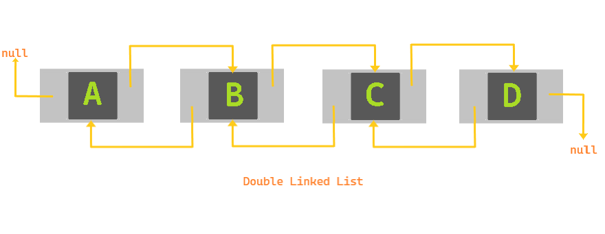

All of us use a browser to surf through the internet. In fact you are using one right now. Have you ever wondered how the forward and backward buttons of the browser work ? Or how the undo and redo functions of your text editor works ?

The answer to this is a doubly linked list. A linked list consists of various individual nodes which store some data as well as a pointer to the next node. A doubly linked list has nodes which have pointers to the previous node as well. In a circular linked list, the last node points to the first node.

Here is how the application is going to work:

Whenever you go to a new website, a new node is added in front of the current node. And the forward and backward button traverse through the linked list.

If you wish to tinker with the code, here is the [Github Repository](https://github.com/code-explorer/Browser-linked-list-implementation).

You can easily expand this program to act like undo and redo buttons of a text editor. Linked list are used in various other practical applications such as photo viewers and music players.

Another think to note is that if you are only going to implement the back button or an undo button, it can also be done using a stack.

This project is a part of a large list of projects based on implementing data structures and algorithms which you can check out here.
