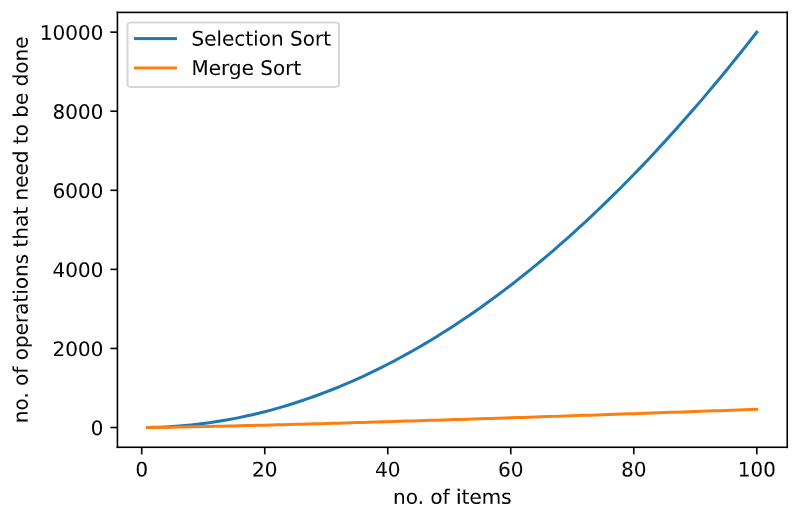

Data Structures and Algorithms are considered one of the most important topics in computer science. This post and the ones linked below are aimed at helping people understand the significance of this topic and also to show how data structures and algorithms can be used in various applications.

Data Structures allow us to store information in a way that helps the programmer solve complex problems quickly while algorithms are basically the instructions for performing a task.

The reason why algorithms are considered important is because a good algorithm can perform the same task millions of times faster than a badly written algorithm. For example, let us say that you have a database with some items that we want to sort. If we compare the number of operations that it takes for selection sort and merge sort for increasing amount of items we get the following graph:

As we can see in the above graph, as the number of items that need to be sorted increases, the time it takes for the sort largely depends on the quality of the algorithm that we are using.

Here are the links to the posts that either implement various data structures and algorithms into some projects or analyze various algorithms to find which algorithm works best and in what situation:

- Browser linked list implementation
- Load balancing simulation using queues
- Analysis of sorting algorithms 
