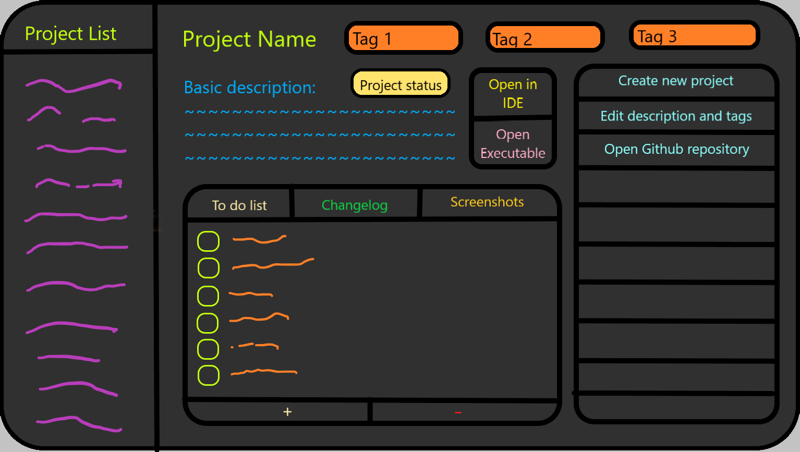

 Welcome to the first project of my blog. Before I start making any major projects, I would like to create a project manager application that will help me keep track of all of my projects. Here is an image of what I want my final application to look like:

The programming language that I am most familiar with at the time of making this project is C++, so that is what I am going to be using for this project. There are many libraries available for making a Graphical User Interface (GUI) in C++ like Qt, wxWidgets, Nana, FLTK, etc. But for this project, I am going to be using Qt as it is really easy to set up and work with. It also has the added benefit of looking great. 

If you wish to follow along, I strongly recommend using the programming language you are most familiar with and using a GUI library available in that language. Here is the source code for the project: Github repository. This post is not going to be a step by step tutorial on how to make the application, rather the aim of this post is to provide a roadmap for building the project on your own.

To start off, I am going to create a window and set the background of the window to a background image that I created. Then to create the look of a clean window, I am going to make it frameless and also make it non-resizable. To finish it off, I am adding a quit button. After these steps, my application looks like this:

All of my projects are stored in a single folder so to get the list of projects to display on the screen, I am going to make a string array of the names of all the project folders and display the strings as a list in the application.

Next up, I am going to add some placeholder buttons in preparation for the further steps. For now none of these buttons work.

